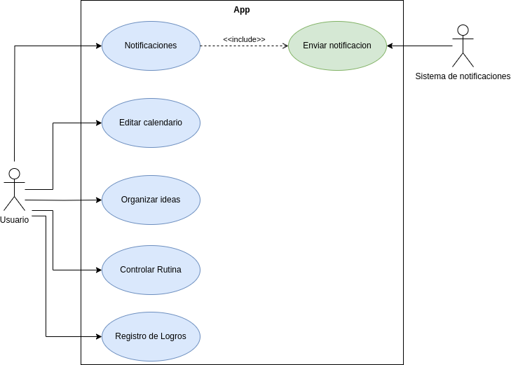

## Organizador Personal

|  Caso de Uso CU.1| Buscar Libro |
|---|---|
| Fuentes | _Este caso de uso se sustenta gracias al documento_  |
| Actor | _Usuario_ |
| Relaciones | _Relaciones que tiene con otros actores. Básicamente cuando realiza las mismas acciones que otro actor._  |
| Referencias | _Que casos de uso realiza_ |   
|  Notas |  _Notas adicionales_ |
| Autor  | _Quien desarrolla la especificación del actor_ |
|Fecha | _Fecha de la especificación_ |

|  Atributo |||
|---|---|---|
| _Nombre_  | _Descripción_  | _Tipo_ |
| | |

### Origen de la idea
La idea para este proyecto surgió cuando miré varias aplicaciones que utilizaba para gestionar mis tareas diarias. Me di cuenta de que usaba varias apps para organizar mi semana, lo cual resultaba poco práctico y desorganizado.  No me gusta la idea de tener múltiples cosas en diferentes aplicaciones.

### Funcionalidad
Mi objetivo es desarrollar una aplicación para móviles o PC que integre varias funciones para la organización personal. Esta aplicación funcionaría como un calendario para programar eventos y recordatorios, un organizador de ideas donde se puedan anotar pensamientos y proyectos, un controlador de rutina para establecer y seguir hábitos diarios, un diario personal para registrar experiencias y reflexiones, y un recuento de logros personales para mantener la motivación y el seguimiento del progreso.

### Beneficios
Esta aplicación no solo simplificaría la gestión de tareas y actividades diarias, sino que también proporcionaría una visión clara de nuestras rutinas y logros.

